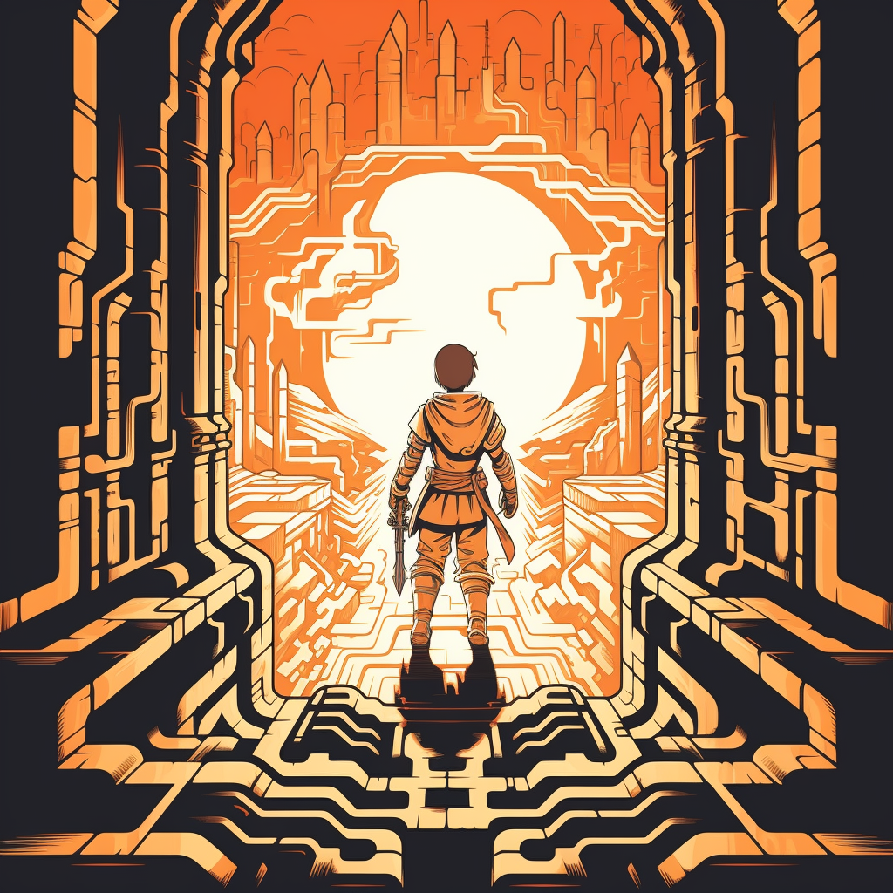

<picture>
  
</picture>

<a href="https://github.com/starkexplore/explore">

</a>

# Explore

## Game Concept

A reimagined version of Minesweeper with elements of loot survivor and features exploiting asymmetric information.

## Gameplay

Players navigate through a grid-based session map, uncovering hidden squares to progress.

## Development

### Prerequisites

- Rust - install [here](https://www.rust-lang.org/tools/install)
- Cairo language server - install [here](https://book.dojoengine.org/development/setup.html#3-setup-cairo-vscode-extension)

### Step 1: Clone the Repository

Start by cloning the repository to your local machine. Open your terminal and type the following command:

```bash
git clone https://github.com/StarkExplore/Explore.git
```

This command will create a local copy of the Dojo Starter repository.

### Step 2: Install `dojoup`

The next step is to install `dojoup`. This cli tool is a critical component when building with dojo. It manages dependencies and helps in building your project. Run the following command in your terminal:

```bash
curl -L https://install.dojoengine.org | bash
```

The command downloads the `dojoup` installation script and executes it.

### Step 3: Build the Example World

With `dojoup` installed, you can now build your example world using the following command:

```bash
sozo build
```

This command compiles your project and prepares it for execution.

### Step 4: Start Katana RPC

[Katana RPC](https://book.dojoengine.org/framework/katana/overview.html) is the communication layer for your Dojo World. It allows different components of your world to communicate with each other. To start Katana RPC, use the following command:

```bash
katana --allow-zero-max-fee
```

### Step 5: Migrate (Deploy) the World

Finally, deploy your world using the `sozo migrate` command. This command, deploys your world to Katana!

```bash
sozo migrate
```

Congratulations! You've successfully setup and deployed your first Dojo Autonomous World.

### Step 6: Play the game

Switch to ExploreTui directory:

```bash
cd ExploreTui
```

build and run the rust UI:

```bash
cargo build
cargo run
```

---

# Interacting With Your Local World

Explore and interact with your locally deployed world! This guide will help you fetch schemas, inspect entities, and execute actions using `sozo`.

If you have followed the example exactly and deployed on Katana you can use the following:

World address: **0x7f1d6c1b15e03673062d8356dc1174d5d85c310479ec49fe781e8bf89e4c4f8**

Signer address: **0x06f62894bfd81d2e396ce266b2ad0f21e0668d604e5bb1077337b6d570a54aea**

## Commands

Coming soon
